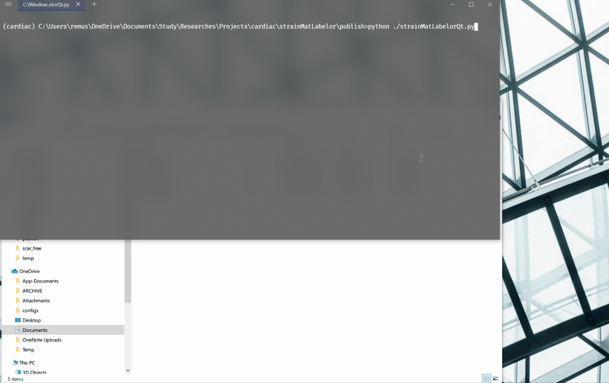
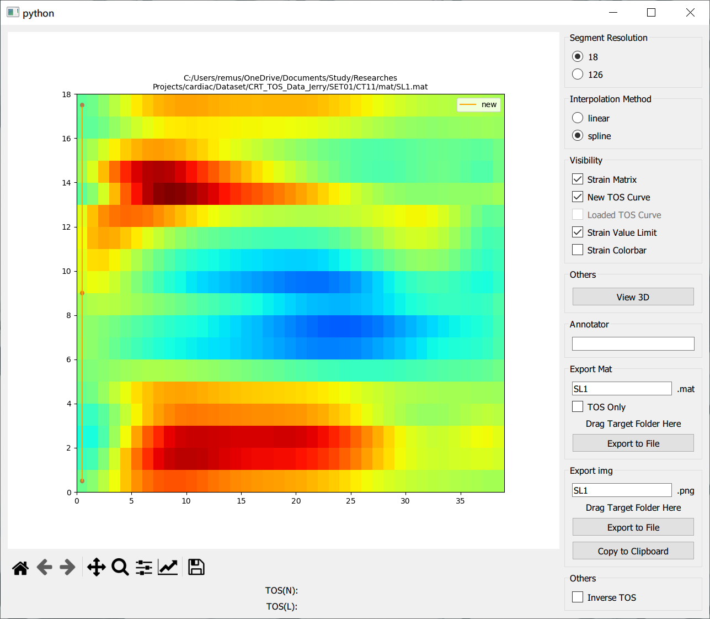
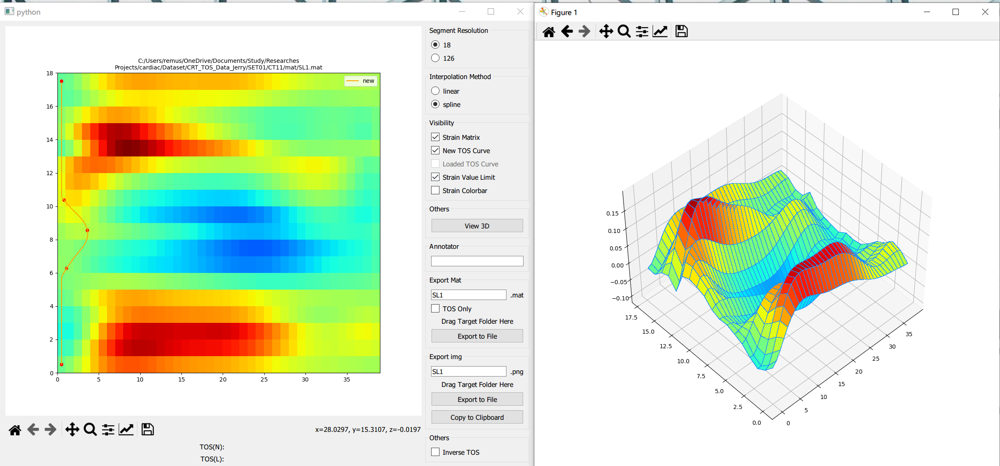
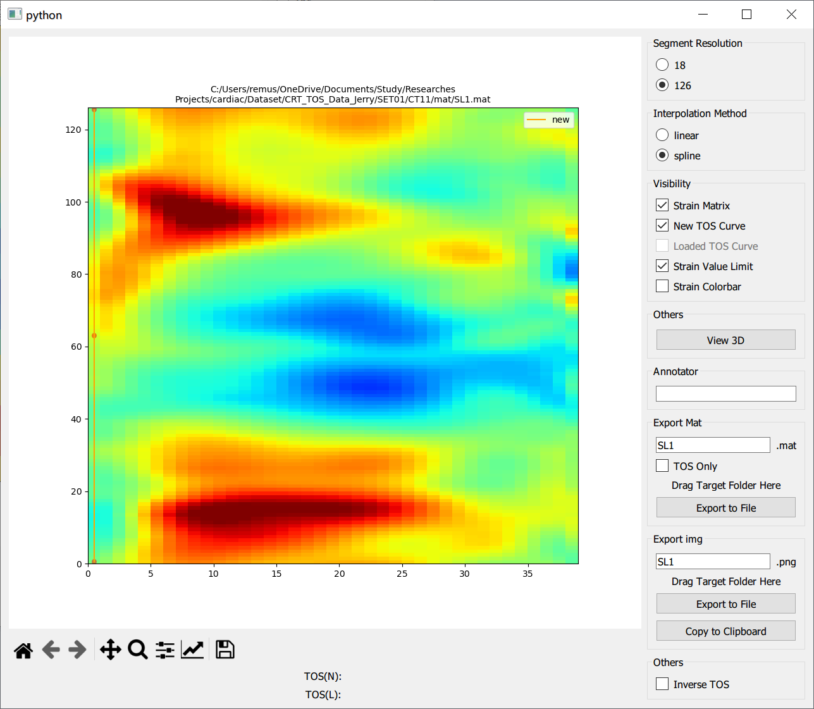
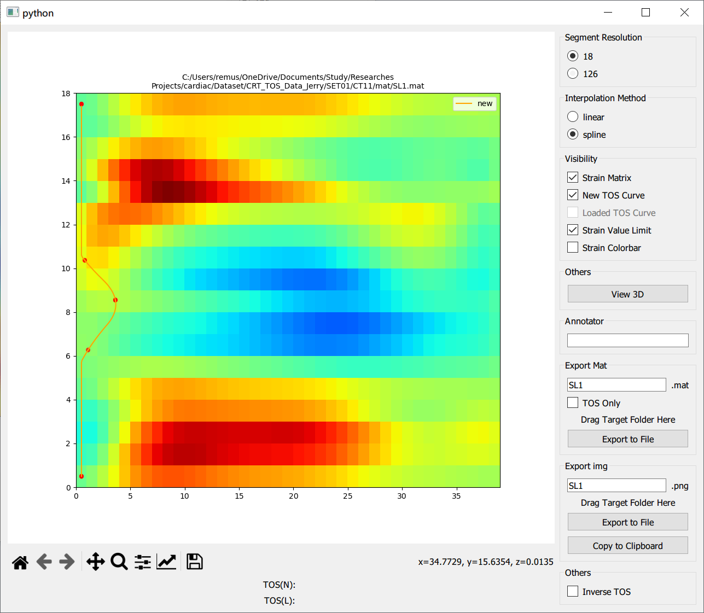
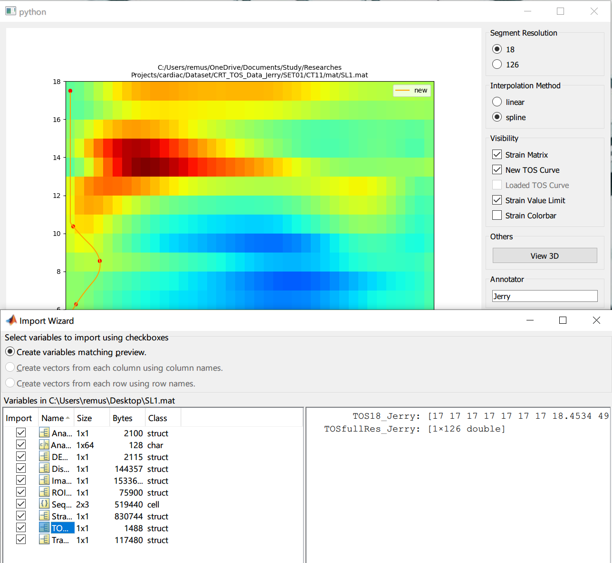
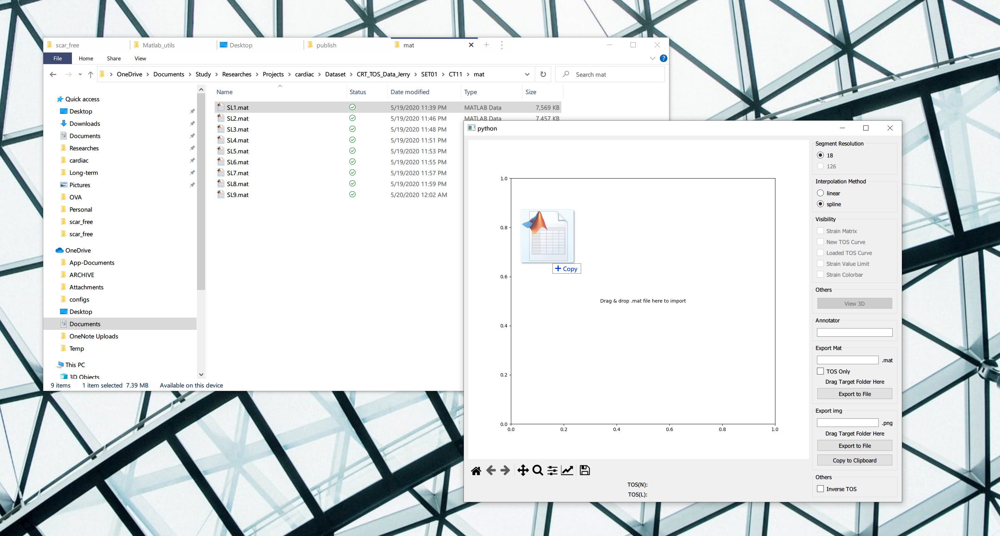
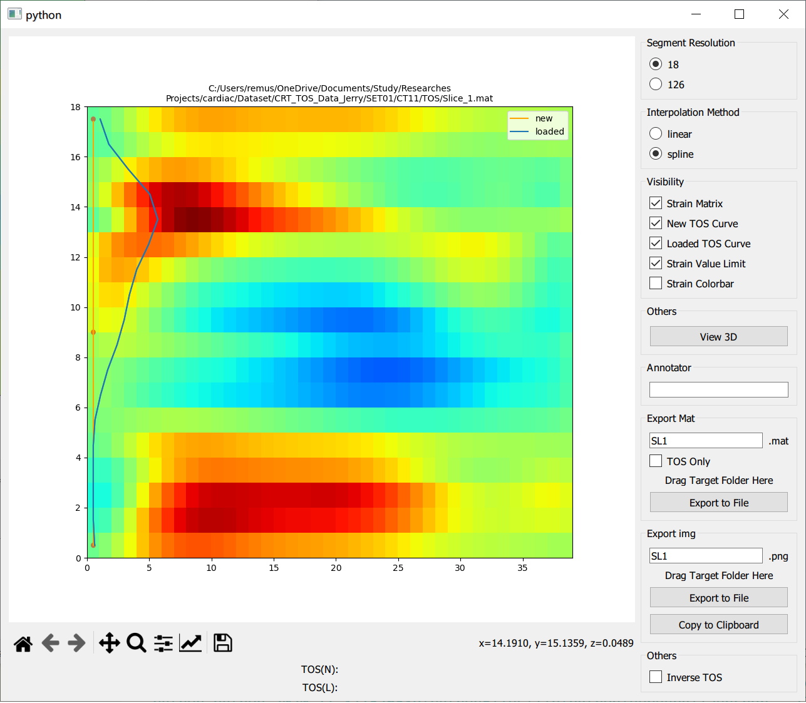
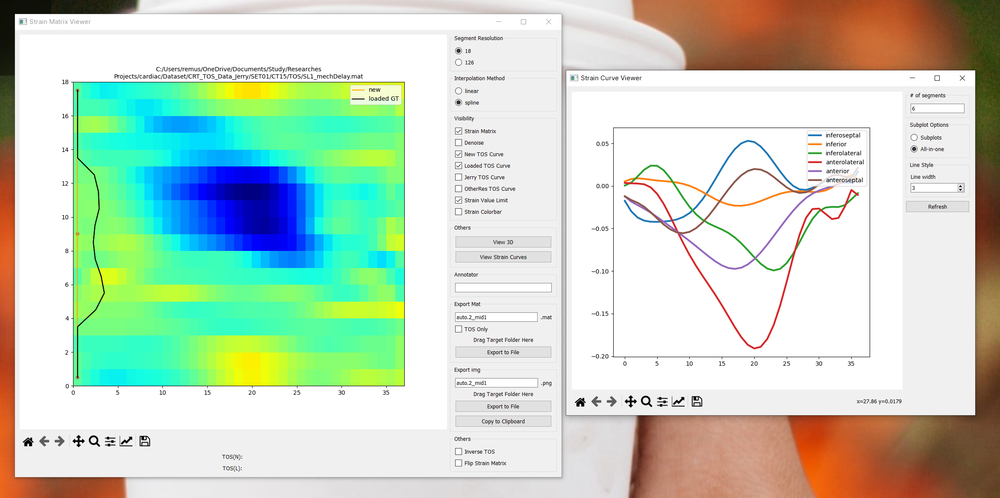

# strainmatLabeler
## Updates
### Ver 1.4.1 (2021-05-28)
- Bug fix
### Ver 1.4 (2021-05-26)
- Add strain curve viewer

### Installation
- Create a python environment (`python 3.6+`) with packages `pyQt5`, `matplotlib`, `numpy` and `scipy`
- Download the lastest release [(v1.4.1)](https://github.com/jr-xing/strainmatLabeler/releases/download/1.4.1/strainMatLabelor-1.4.1.zip)
- run `python strainMatLabelorQt.py`

## 1 Introduction and Functions
This software enable user to check the strain matrix from .mat file exported by [DENSEAnalysis](https://github.com/denseanalysis/denseanalysis) software and add new TOS curves.

The functions include:
### 1.1 Visualize Strain Matrix

### 1.2 Generate and Visualize "Full-Resolution" Strain Matrix

### 1.3 Add TOS Labels

### 1.4 Export to .mat File or Image

## 2 Instructions
### 2.1 Load .mat File Containing Strain Matrix
Drag `.mat` file exported by DENSEAnalysis to the left canvas.

### 2.2 Load .mat File Containing TOS Curve
Drag `.mat` file containing TOS to the left canvas.

### 2.3 Check Strain Matrix
Please feel free to try the options on the right panel.
### 2.4 Check Strain Curves (NEW)

Click `View Strain Curves` to view the mean strain curves in each segment in a new cuvre viewer window. When the strain matrix in the main window is updated, the curves in the curve viewer window will update automatically.
### 2.5 Annotate New TOS Curve
- Add a control point: mouse middle click at target location
- Remove a control point: mouse right click at target point
- Move a control point: mouse left click at target point
### 2.6 Export

If `TOS only` is checked, the added TOS data will be store at the root path of the saved file; otherwise, the TOS data would be stored inside `TOSAnalysisInfo`, and the annotator name will be appended. 
